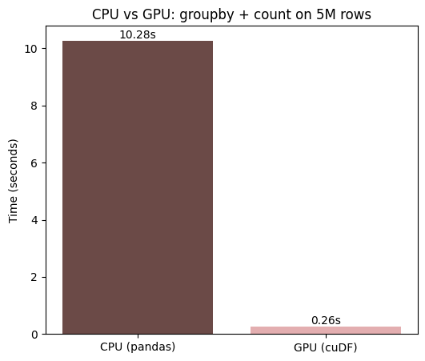

# GPU vs CPU Benchmark: pandas vs. RAPIDS cuDF

A hands-on comparison of CPU-based data processing (pandas) against GPU-accelerated processing (NVIDIA's RAPIDS cuDF) on a real 5-million-row dataset.

## Why this project

I wanted to actually understand, hands-on, why GPUs matter for data and AI workloads beyond just knowing the term. cuDF is designed to be a near drop-in replacement for pandas, same syntax, same logic, but it runs on the GPU instead of the CPU. Benchmarking the two side by side on identical data and identical code felt like the clearest way to see the difference for myself.

## Dataset

IMDB's public `title.principals` dataset (cast and crew credits) — the full file is over 101 million rows. For this benchmark, I used the first 5 million rows, loaded from a local copy in the Colab environment to keep the comparison fair and consistent between runs.

Source: [datasets.imdbws.com](https://datasets.imdbws.com/)

## What I measured

The same operation, run two ways: loading the file and grouping cast/crew credits by job category (actor, director, writer, etc.), timed start to finish with Python's `time` module.

| | Time |
|---|---|
| CPU (pandas) | 10.28 seconds |
| GPU (cuDF) | 0.26 seconds |

**~40x faster on the GPU**, for the identical operation, on identical data, with identical results.

## What I ran into along the way

- The dataset I originally planned to use was a public S3 bucket from a university course I'd taken — it returned a 403 Forbidden error, since the course had ended and the bucket was taken down. Switched to IMDB's own permanently public dataset instead.
- Loading the full 101M-row file with plain pandas crashed the Colab session by using up all available memory — a small, real preview of exactly the kind of problem GPUs and distributed tools exist to solve. Fixed by working with a 5-million-row slice instead.
- cuDF's GPU reader struggled to decompress a `.gz` file while also only partially reading it over a network connection. Fixed by downloading and fully unzipping the file locally first, which also made the CPU/GPU comparison more consistent.

## Why the GPU is faster here

Grouping and counting 5 million rows means doing the same simple operation millions of times. A CPU processes this mostly in sequence. A GPU has thousands of smaller cores that can each handle a slice of the data at the same time — the same reason GPUs became central to training AI/ML models, which rely on that exact "same operation, repeated millions of times" pattern.

## How to run

Open the notebook in Google Colab, set the runtime to a GPU (Runtime → Change runtime type → T4 GPU), and run all cells top to bottom.
